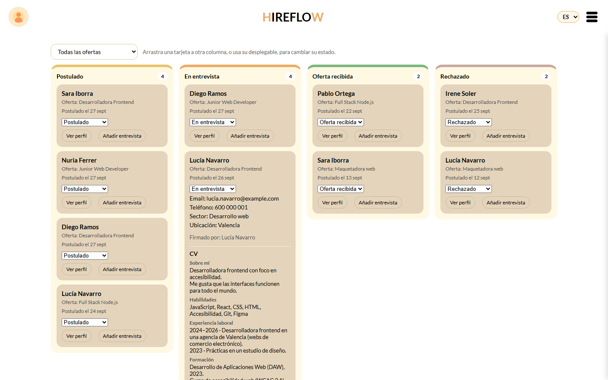
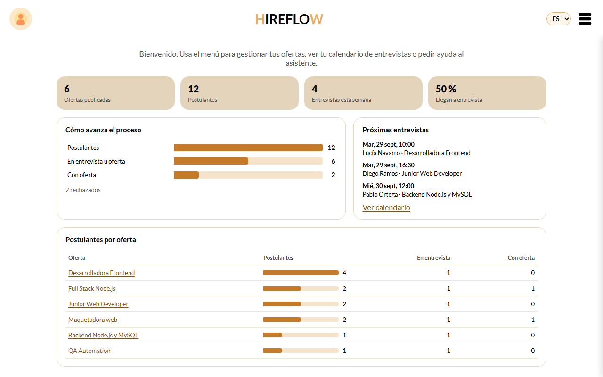
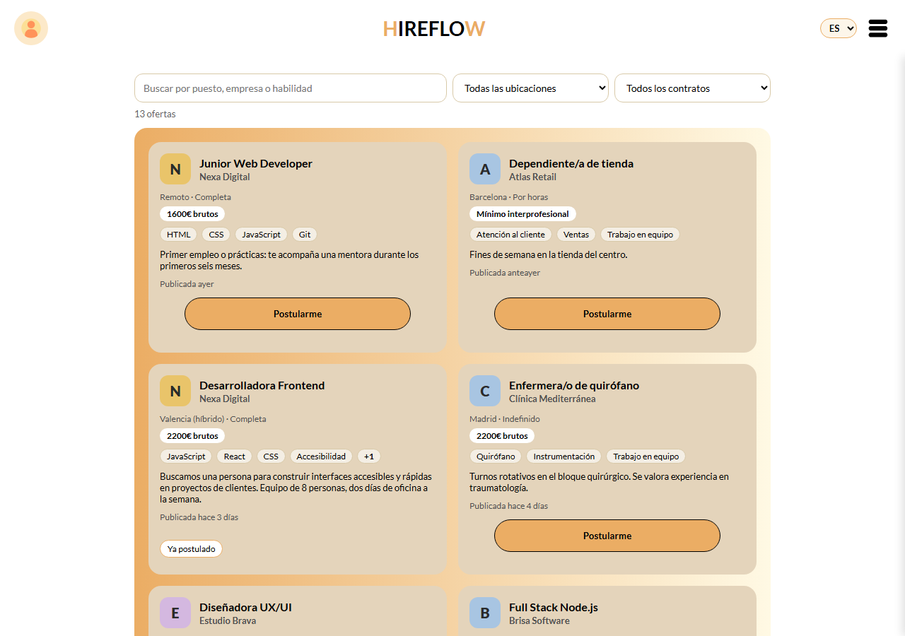
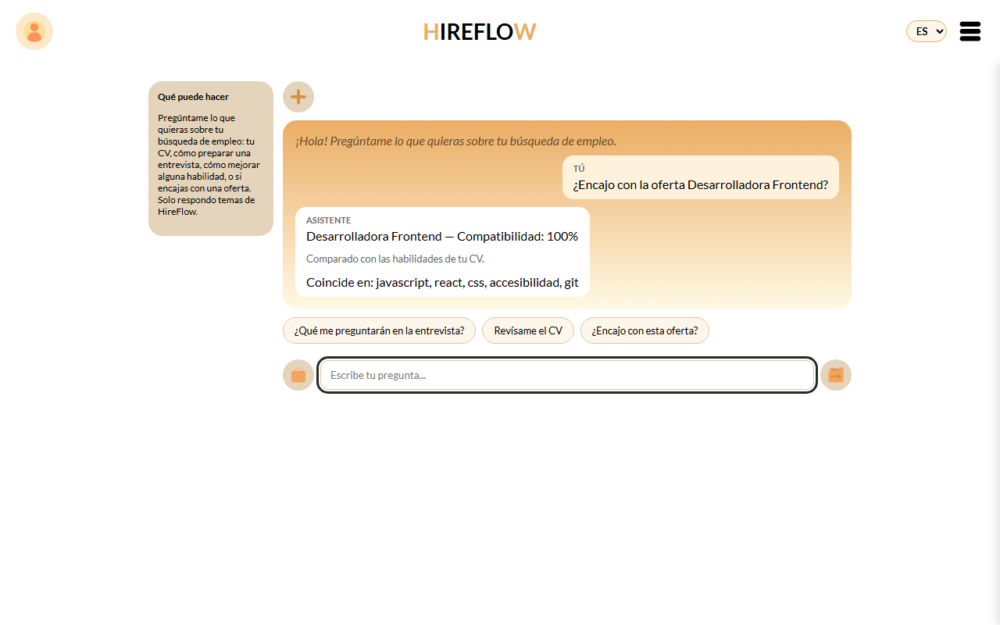
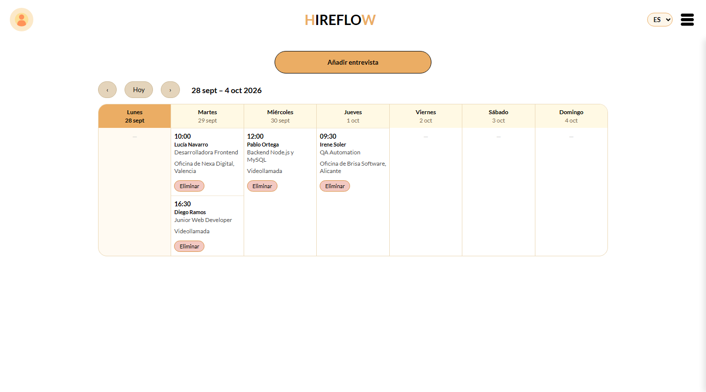
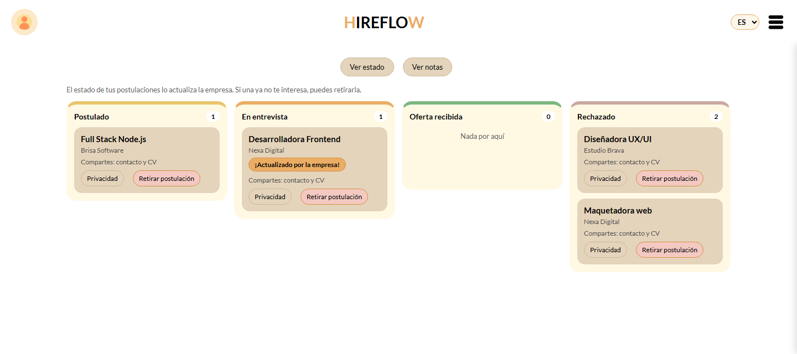
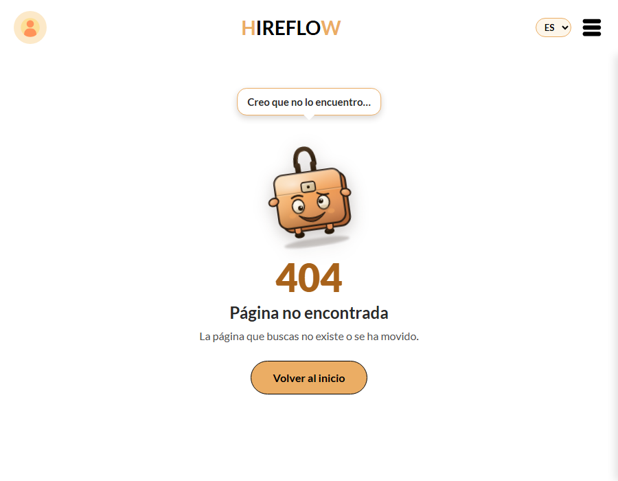
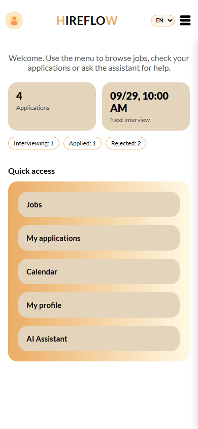

# HireFlow

**Organiza la búsqueda de empleo desde los dos lados: candidatos que buscan trabajo y empresas que seleccionan.**

[](https://github.com/anaborrellrichart79-debug/hireflow/actions/workflows/tests.yml)




> Proyecto de portfolio. La publicación en Google Play está en pausa (ver [Estado](#estado)).

---

## Qué hace

**Para quien busca empleo**
- Busca ofertas por puesto, empresa o habilidad, con filtros por ciudad y tipo de contrato.
- Se postula dando su consentimiento para compartir el contacto y, si quiere, su CV. Puede retirar cualquiera de los dos cuando quiera.
- Sigue sus procesos en un tablero y recibe avisos cuando la empresa los mueve.
- Un asistente le dice si su CV encaja con una oferta, le propone preguntas de entrevista y le da consejos para mejorar su CV y sus habilidades.

**Para las empresas**
- Publican ofertas y ven un panel con cómo avanza cada proceso.
- Mueven a los candidatos por las fases arrastrando tarjetas en un tablero Kanban.
- Ven el contacto y el CV de cada candidato, solo si este lo ha compartido.
- Agendan entrevistas en un calendario semanal, que el candidato ve al momento.

| | |
|---|---|
|  |  |
| **Panel de la empresa**: métricas, embudo y postulantes por oferta | **Ofertas**: buscador sin tildes, filtros y tarjetas completas |
|  |  |
| **Asistente**: compara el CV con la oferta | **Calendario** por semanas |
|  |  |
| **Mis postulaciones**: el estado lo mueve la empresa | **404**: la mascota da tres vueltas buscando la página |

<p align="center"></p>

---

## Qué hay detrás

- **Seguridad.** Nadie puede ver ni tocar los datos de otro usuario: la comprobación va dentro de cada consulta SQL. Hay permisos por rol, contraseñas con bcrypt, límite de intentos de login, cabeceras de seguridad y CSP con helmet, y borrar la cuenta pide la contraseña.
- **Privacidad (RGPD).** Consentimientos separados para contacto y CV, oferta a oferta, que se pueden retirar. Borrado de la cuenta desde la app y por web. [Política de Privacidad](https://anaborrellrichart79-debug.github.io/hireflow/) pública en 4 idiomas.
- **Accesibilidad.** Auditada con axe-core (WCAG 2.1 A y AA) en cada pantalla y diálogo, usable con teclado, con foco visible y respeto por `prefers-reduced-motion`.
- **4 idiomas.** Español, inglés, francés e italiano, también en los mensajes del servidor, el asistente y la política.
- **Calidad.** 127 pruebas automáticas (API e interfaz, con Playwright) que se ejecutan en cada cambio con GitHub Actions, sobre una base de datos creada desde cero.
- **App instalable (PWA)** y responsive hasta 320 px de ancho.
- **Documentada.** [Arquitectura](docs/architecture.md) con diagramas, [API](docs/api.md), [base de datos](docs/Database.md), [roadmap](docs/roadmap.md) y **45 decisiones técnicas** explicadas en [`decisions.md`](docs/decisions.md): el problema, las alternativas, qué se eligió y cómo se comprobó.

## Tecnologías

| | |
|---|---|
| **Frontend** | HTML, CSS y JavaScript con módulos ES, sin frameworks: router propio, componentes y traducciones |
| **Backend** | Node.js, Express, express-validator, JWT, bcrypt, helmet, express-rate-limit |
| **Base de datos** | MySQL 8 |
| **Pruebas** | Playwright Test y axe-core; GitHub Actions |
| **Publicación** | GitHub Pages (política, borrado de cuenta y 404) |

---

## Cómo arrancarlo

Necesitas **Node.js 20 o posterior** y **MySQL 8**.

1. **Base de datos**: ejecuta en orden `backend/database/schema.sql`, `seed.sql` y `seed_ai_translations.sql`, con `--default-character-set=utf8mb4` para que las tildes se guarden bien. Crean todas las tablas y el contenido del asistente en los 4 idiomas.
   Si ya tenías una base de una versión anterior, aplica en orden los archivos de `backend/database/migrations/` que te falten.
2. **Configuración**: copia `backend/.env.example` a `backend/.env` y rellena tus datos de MySQL y un `JWT_SECRET` largo y aleatorio.
3. **Dependencias**: `npm install` en la raíz y en `backend/`.
4. **Arrancar**: `npm start` en `backend/` (o `npm run dev` para que se reinicie al guardar) y abre http://localhost:3000.

### Datos de demostración

```bash
npm run demo:data         # rellena la base hireflow_demo con un escenario completo
npm run demo:start        # arranca la app con esos datos
npm run demo:screenshots  # regenera las capturas de este README
```

Cuentas: `lucia.navarro@example.com` (candidata) y `marta.gil@example.com` (empresa), con contraseña `Demo2026!`. Todos los datos son ficticios. Guion del vídeo de demostración: [`docs/demoVideo.md`](docs/demoVideo.md).

### Pruebas

```bash
npx playwright install chromium   # solo la primera vez
npm test                          # todas (arranca la app si no está en marcha)
npm run test:api                  # solo la API
npm run test:e2e                  # solo la interfaz
```

---

## Estructura

```
hireflow/
├── frontend/            app (index.html), páginas públicas, estilos, iconos, service worker
│   └── js/              app.js, router.js, api.js, i18n.js, components/, screens/
├── backend/
│   ├── server.js        Express, seguridad, rutas /api
│   ├── routes/ controllers/ models/ validators/ middleware/
│   ├── i18n/            mensajes de la API en 4 idiomas
│   └── database/        schema.sql, seed*.sql, migrations/
├── tests/               pruebas de la API y de la interfaz (Playwright)
├── scripts/             datos de demostración y capturas
├── docs/                arquitectura, API, base de datos, decisiones, roadmap, changelog
└── .github/workflows/   pruebas y publicación en GitHub Pages
```

## Estado

**Proyecto de portfolio.** La app está completa y probada, y la preparación para publicarla en Google Play está hecha: borrado de la cuenta, PWA y ajustes para desplegarla detrás de un proxy. La publicación está en pausa porque el nombre «HireFlow» ya lo usan otros productos del mismo sector. El detalle está en [`decisions.md`, entrada 043](docs/decisions.md), y lo que falta, en el [roadmap](docs/roadmap.md).

## Autora

¡Hola! Soy Ana Borrell, desarrolladora frontend junior en formación, apasionada por crear experiencias web interactivas y funcionales. Este portfolio contiene los proyectos que he desarrollado para demostrar mis habilidades en **HTML5, CSS3, JavaScript y React**, y sirve como carta de presentación para oportunidades profesionales. En este caso en concreto, una aplicación para organizar el caótico mundo de la busqueda de empleo.
