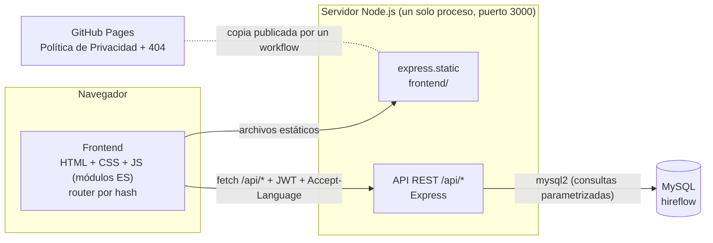
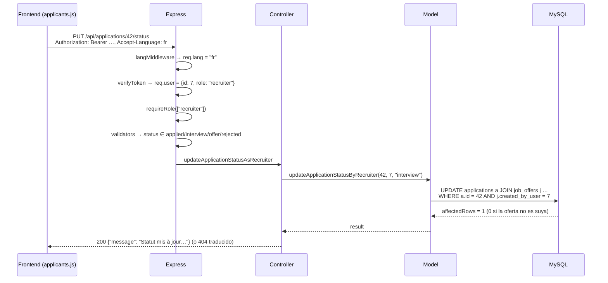
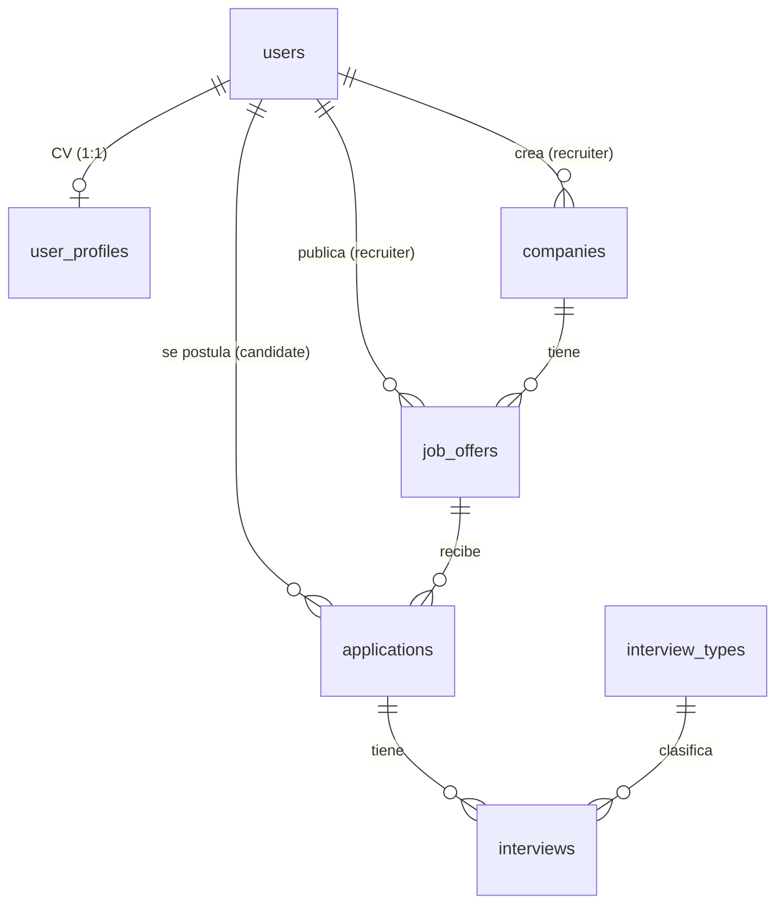

# HireFlow — Arquitectura

Última actualización: septiembre 2026

Este documento explica **cómo encajan las piezas** de HireFlow y **por qué** están así. La estructura de carpetas está en el `README.md`, los endpoints en `api.md`, las tablas en `Database.md`, y el detalle de cada decisión en `decisions.md` (se cita como "entrada NNN").

---

## 1. Visión general

HireFlow es una aplicación web con dos roles, **candidate** (busca empleo) y **recruiter** (publica ofertas y gestiona postulantes), en 4 idiomas (es, en, fr, it).



- **Un solo servidor.** Express sirve el frontend y la API desde el mismo origen: no hace falta CORS y el frontend llama a rutas relativas (`/api/...`). Entrada 011.
- **Sin framework ni bundler en el frontend.** Módulos ES nativos, un router propio por hash (`#/jobs`, `#/calendar`...) y un helper `el()` para crear el DOM sin plantillas de texto (evita XSS por construcción). Entrada 011.
- **La "IA" no es un LLM.** El asistente clasifica el mensaje por palabras clave y responde con contenido curado en tablas de la base de datos, en los 4 idiomas. Decisión explícita de la usuaria, por coste y control. Entradas 010, 014, 026 y 028.

---

## 2. Backend

### 2.1 Capas

```
server.js
  └─ middlewares globales:  helmet (cabeceras + CSP) → langMiddleware → express.json → express.static
       └─ routes/          qué middlewares y qué controller tiene cada ruta
            ├─ verifyToken       JWT → req.user = { id, email, role }
            ├─ requireRole       403 si el rol no está permitido
            ├─ loginLimiter      solo en /users/login
            ├─ validators + validate   express-validator → 400 con errores por campo
            └─ controllers/      lógica HTTP: status, qué modelo llamar, qué responder
                 └─ models/      SQL (mysql2), con la comprobación de propiedad dentro de la query
  └─ 404 HTML (fuera de /api) → notFound → errorHandler
```

- **routes** solo encadena middlewares; **controllers** decide la respuesta; **models** es el único sitio con SQL.
- **asyncHandler** envuelve cada controller: cualquier error que no se maneje llega a `errorHandler`, que nunca expone detalles internos en un 500 (entrada 007).
- **Validación antes del controller**: todo `POST`/`PUT` pasa por `express-validator`. Los controllers pueden fiarse del tipo y la forma del body (entrada 008).

### 2.2 Recorrido de una petición

Ejemplo: una empresa cambia el estado de un postulante (`PUT /api/applications/42/status`).



### 2.3 Seguridad

| Riesgo | Cómo se cubre | Entrada |
|---|---|---|
| Ver o tocar datos de otro usuario (IDOR) | La propiedad se comprueba **dentro de la propia query** (`WHERE id = ? AND user_id = ?`, o `JOIN job_offers … created_by_user = ?`), nunca con un `SELECT` previo. Las rutas del usuario actual usan `/me` en vez de `/:id`. | 001, 002, 005, 017, 019 |
| Acceder sin permiso por rol | `requireRole` después de `verifyToken`. | 003 |
| Inyección SQL | Siempre consultas parametrizadas; los `UPDATE` dinámicos usan listas blancas de columnas. | 001 y siguientes |
| XSS | El frontend crea el DOM con `el()`/`textContent`, nunca con `innerHTML` a partir de datos. CSP de `helmet` sin scripts inline. | 011, 021, 022 |
| Averiguar qué emails existen / fuerza bruta | Login con mismo mensaje, mismo código y mismo tiempo; máximo 10 intentos fallidos por IP cada 15 min. | 020 |
| Contraseñas | `bcrypt`, 8–72 caracteres con letra y número. | 021 |
| Borrar la cuenta con una sesión ajena | `DELETE /users/me` pide la contraseña actual. | 042 |
| Falsear la IP para saltarse el límite de login | `trust proxy` solo con `TRUST_PROXY` (el número de proxies reales delante). | 042 |
| Fugas en errores | Un 500 nunca devuelve el mensaje interno ni datos del driver. | 007 |
| Datos de contacto y CV | Solo viajan a la empresa si el candidato dio el consentimiento correspondiente, comprobado con `CASE WHEN` en la SQL (no en el frontend). Se puede retirar. | 017, 033, 034 |

### 2.4 Idioma de las respuestas

`langMiddleware` (`backend/i18n/`) lee `Accept-Language` y fija `req.lang` y `req.t(clave)`. Los mensajes (69) y los nombres de campo (41) están en `i18n/messages.js` en los 4 idiomas; los validadores generan su mensaje al validar con `msg(clave)`. Sin cabecera, todo sale en español (compatibilidad con Postman y clientes antiguos). Entrada 038.

---

## 3. Frontend

```
index.html
  └─ app.js            registra las rutas, cabecera, selector de idioma, mascota
       ├─ router.js    #/ruta → screens/<pantalla>.render(container, params)
       │               guarda de sesión, 404, refresh() al cambiar de idioma
       ├─ api.js       fetch a /api: JWT, Accept-Language, 401 → sesión caducada
       ├─ i18n.js      diccionario de la interfaz (es/en/fr/it) y t(clave)
       ├─ components/  ui.js (el, openDialog, banners), header, cardGrid, kanban,
       │               recruiterDashboard, privacyPolicyDialog, lostMascot
       └─ screens/     login, home, jobs, jobForm, applications, applicants,
                       calendar, profileForm, ai
```

- **Una pantalla = un módulo** con `render(container, params)`. El router vacía el contenedor y llama a `render`; al cambiar de idioma se vuelve a llamar (`refresh()`), sin perder la ruta (entrada 012).
- **Estado mínimo**: lo que viene de la API se vuelve a pedir al redibujar. El token JWT y el idioma viven en `localStorage`; el rol se lee del propio token (sin petición extra).
- **Diálogos**: `openDialog()` sobre `<dialog>` nativo (foco atrapado, Escape y fondo gratis). Nunca `alert`/`confirm` nativos (entradas 017, 023, 030).
- **Accesibilidad**: `linkLabels()` asocia cada `<label>` con su campo tras pintar cada pantalla; foco visible, "saltar al contenido", `prefers-reduced-motion`. Auditado con axe-core (WCAG 2.1 A/AA) en cada cambio de interfaz (entrada 029).
- **Páginas independientes**: `privacy.html`, `delete-account.html` y `404.html` no usan el router ni el login, para poder publicarse solas; las dos primeras comparten `publicPage.js` (entradas 035, 036, 042).
- **App instalable (PWA)**: `manifest.webmanifest` e iconos; `sw.js` solo intercepta la navegación para mostrar `offline.html` sin conexión y **no** guarda en caché la app ni la API, para que tras un despliegue nadie se quede con la versión vieja (entrada 042).

---

## 4. Datos

MySQL con 14 tablas (detalle en `Database.md`). El núcleo:



- **Propiedad**: `applications.user_id` es el candidato; lo que puede tocar la empresa se deriva de `job_offers.created_by_user`. `interviews` no tiene dueño propio: hereda el de su postulación (entrada 005).
- **Restricciones que protegen la lógica**: `UNIQUE(user_id, job_offer_id)` en `applications` (una postulación por oferta, entrada 027), `UNIQUE(user_id)` en `user_profiles` (upsert atómico del CV, entrada 033).
- **Catálogo del asistente**: `ai_interview_questions`, `ai_resume_guides`, `ai_skill_improvement` (español) + `ai_content_translations` (en/fr/it) (entrada 028).
- **Cambios de esquema**: `schema.sql` describe siempre la versión actual; cada cambio para bases ya creadas va en `database/migrations/NNN_*.sql`, numerado como su entrada de `decisions.md`.
- Hay tablas en el esquema que la app todavía no usa: `application_notes`, `contacts` y `calendar_events` (esta tiene API, `/calendar`, pero el calendario de la app muestra `interviews`). Ver `roadmap.md`.

---

## 5. Publicación y entornos

| Qué | Dónde | Cómo |
|---|---|---|
| App completa (frontend + API) | Local, `http://localhost:3000` | `npm start` en `backend/`, con `backend/.env` (ver `.env.example`). No está desplegada en ningún servidor. |
| Base de datos | MySQL local: `hireflow` (desarrollo) y `hireflow_demo` (datos de demostración) | `schema.sql` + `seed.sql` + `seed_ai_translations.sql`; migraciones para bases existentes. |
| Política de Privacidad, "Cómo eliminar tu cuenta" y 404 | GitHub Pages: https://anaborrellrichart79-debug.github.io/hireflow/ (y `delete-account.html`) | `.github/workflows/privacy-page.yml` publica **solo** esos archivos en cada cambio en `main` (entradas 035, 036, 039, 042). |

---

## 6. Pruebas

Pruebas automáticas con **Playwright Test** en `tests/` (entrada 040), contra el servidor real y una MySQL real:

```
tests/
  helpers.js     usuarios de prueba que se borran solos, axe-core, paquete de Pages, servidor aparte
  api/           seguridad (propiedad y roles), CV, consentimientos, idiomas, login y límite de intentos
  e2e/           registro y login, Inicio, ofertas, Kanban, calendario, asistente, CV, consentimientos,
                 Política de Privacidad, 404 e idiomas (navegador + accesibilidad)
```

- `npm test` arranca la app si no está en marcha y ejecuta todo (`npm run test:api`, `npm run test:e2e` por separado).
- Cada archivo crea sus propios usuarios (`pw_…@test.local`) y los borra al terminar.
- **Accesibilidad**: axe-core (WCAG 2.1 A/AA) en cada pantalla y diálogo probados. **Consola**: cualquier error de JavaScript o de consola hace fallar la prueba.
- **GitHub Pages**: el paquete se genera con el mismo paso del workflow de publicación y se sirve como lo haría Pages.
- **Límite de intentos de login**: se prueba contra una instancia aparte del servidor, para no bloquear el login del resto de pruebas.
- **Integración continua** (`.github/workflows/tests.yml`): en cada push y pull request a `main`, crea una MySQL limpia solo con `schema.sql` y los `seed`, y pasa todas las pruebas. Así también se comprueba que una instalación desde cero funciona.
- La colección de Postman (`postman/`) sigue sirviendo para probar la API a mano.

---

## 7. Convenciones

- **Documentar antes de cerrar**: cada cambio relevante tiene su entrada en `decisions.md` (problema, alternativas, decisión, verificación, archivos), su línea en `changeLog.md` y, si toca la API o la BD, `api.md`/`Database.md`.
- **Textos de interfaz** siempre en `i18n.js` (4 idiomas); **mensajes de la API** en `backend/i18n/messages.js` (4 idiomas); **Política de Privacidad** en `privacyPolicyContent.js` (4 idiomas, las cuatro deben decir lo mismo).
- **Códigos estables, etiquetas traducidas**: lo que se guarda en la BD (estados, tipos de contrato...) es un código en inglés; la interfaz lo traduce al mostrarlo (entrada 012).
- Commits en español con prefijo (`feat:`, `fix:`, `chore:`), directamente sobre `main`.
